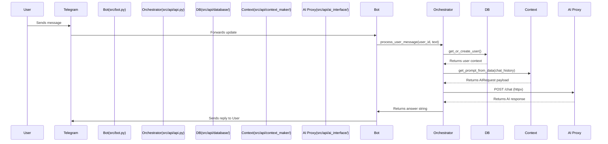

# MyAiTgBot

**MyAiTgBot** is an asynchronous Telegram bot designed to maintain contextual, human-like conversations with users. It leverages an external AI proxy for natural language processing, persists user context in MongoDB, and features structured logging for production-grade observability.

---

## 📋 Key Features

- **Async-First Architecture**: Built with `aiogram 3.x`, `asyncio`, and `motor` for non-blocking I/O.
- **Persistent Context Management**: Stores chat history and AI context per user in MongoDB.
- **Dynamic Prompt Engineering**: Automatically formats conversation history into structured AI requests with system-level behavioral instructions.
- **External AI Integration**: Communicates with a configurable AI proxy/API via `httpx`.
- **Structured Logging**: Dedicated loggers for database operations, API calls, service events, and error tracking.
- **Environment-Driven Configuration**: Secure, type-safe settings management via `pydantic-settings`.

---

## 🏗️ System Architecture & Data Flow



> **Note**: The current implementation maintains context in-memory per request. The `save_user_context()` utility is available in the database module for persistent history synchronization.

---

## 🛠️ Prerequisites

- **Python**: `3.10` or higher
- **Database**: MongoDB instance (local or cloud)
- **External Service**: Access to an AI chat proxy/API endpoint
- **Package Manager**: `pip` or `uv`

---

## 🚀 Installation & Setup

### 1. Clone the Repository
```bash
git clone <repository-url>
cd MyAiTgBot
```

### 2. Create & Activate Virtual Environment
```bash
python -m venv venv
source venv/bin/activate  # On Windows: venv\Scripts\activate
```

### 3. Install Dependencies
```bash
pip install -r requirements.txt
```

### 4. Configure Environment Variables
Copy the example configuration and populate it with your credentials:
```bash
cp .env.example .env
```

### 5. Run the Application
```bash
python main.py
```

---

## ⚙️ Configuration

All settings are managed via `.env` and validated using Pydantic.

| Variable | Type | Required | Description |
|----------|------|----------|-------------|
| `TELEGRAM_TOKEN` | `str` | ✅ | Bot token from [@BotFather](https://t.me/BotFather) |
| `API_CHAT_URL` | `str` | ✅ | Endpoint for the external AI chat proxy |
| `EMBED_URL` | `str` | ✅ | Embedding service URL (reserved for future vector search) |
| `MONGO_URL` | `str` | ✅ | MongoDB connection string (e.g., `mongodb://localhost:27017`) |
| `MONGO_DB_NAME` | `str` | ✅ | Target database name (default: `ai_lifestyle_bot`) |
| `PROXY_URL` | `str` | ❌ | HTTP/HTTPS proxy for outbound requests |

---

## 📡 AI Request Schema

The bot formats conversations into the following JSON structure before sending to the AI proxy:

```json
{
  "contents": [
    {
      "role": "user",
      "parts": [{ "text": "User message..." }]
    },
    {
      "role": "model",
      "parts": [{ "text": "AI response..." }]
    }
  ],
  "system_instruction": "Твоя задача сделать жизнь пользователя лучше...",
  "temperature": 0.7,
  "max_output_tokens": 1000,
  "top_p": 0.95,
  "top_k": 40
}
```

The proxy is expected to return:
```json
{
  "answer": "AI generated response text"
}
```

---

## 📝 Logging & Monitoring

The application initializes structured logging on startup. Logs are written to both the console and dedicated files in the `logs/` directory:

| Logger | File | Level | Purpose |
|--------|------|-------|---------|
| `database` | `logs/database.log` | `INFO` | MongoDB operations & context sync |
| `proxy` | `logs/proxy.log` | `INFO` | Outbound AI API requests & responses |
| `service` | `logs/service.log` | `INFO` | General application lifecycle events |
| `errors` | `logs/errors.log` | `ERROR` | Critical failures & stack traces |

> The `logs/` directory is created automatically if it does not exist.

---

## 🗂️ Project Structure

```
MyAiTgBot/
├── main.py                 # Application entry point
├── requirements.txt        # Python dependencies
├── .env.example            # Environment template
├── src/
│   ├── __init__.py
│   ├── bot.py              # aiogram dispatcher & handlers
│   ├── config.py           # Pydantic settings loader
│   ├── logger_config.py    # Logging initialization
│   └── api/
│       ├── api.py          # Message orchestration layer
│       ├── ai_interface/   # External AI proxy client
│       ├── context_maker/  # Prompt & history formatting
│       ├── database/       # MongoDB async operations
│       └── models/         # Pydantic data schemas
└── legacy/ & legacy2/      # Archived code (deprecated)
```

> **Legacy Code**: The `legacy/` and `legacy2/` directories contain previous iterations of the bot. They are excluded from the active runtime and should be treated as reference material only.

---

## 🛡️ Development Notes

- **Context Persistence**: The `save_user_context()` function is implemented but not invoked in the current request pipeline. Integrate it into `process_user_message()` if long-term history retention is required.
- **Error Handling**: Network timeouts and HTTP errors from the AI proxy are raised via `response.raise_for_status()`. Consider wrapping the AI call in a retry mechanism for production resilience.
- **Security**: Never commit `.env` to version control. The `.gitignore` is configured to exclude it.

---

## 📜 License

This project is proprietary/internal. All rights reserved.  
*For licensing inquiries, contact the project maintainer.*